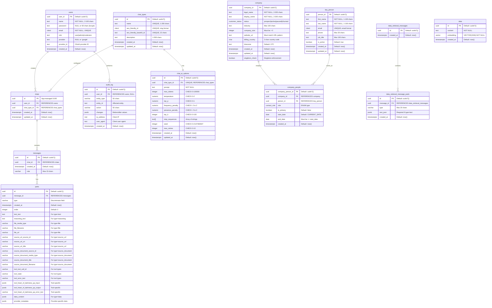

# Database Entity Relationship Diagram (ERD)

## Schema Overview

This ERD represents the database schema for the AI chat application with user authentication, chat management, CRM/company management, vector data (RAG), data retrieval, and audit logging.

## Table Descriptions

### **users**

Stores user accounts with support for both password-based and OAuth authentication (Google).

- **Primary Key**: `user_id` (UUID v7)
- **Unique Constraint**: `email` (case-insensitive via CITEXT)
- **Roles**: user, admin, moderator
- **OAuth Support**: Google provider with provider_id

### **data**

Stores vector embeddings for RAG (Retrieval-Augmented Generation) functionality.

- **Primary Key**: `id` (UUID v7)
- **Embedding**: VECTOR(1536) for OpenAI text-embedding-ada-002 or text-embedding-3-small
- **Index**: IVFFlat index on embedding column for cosine similarity search
- **Supported Models**: OpenAI (1536/3072), Google (768), Cohere (1024), Anthropic (1536)

### **company**

Stores company/customer information (singleton table - only one record allowed).

- **Primary Key**: `company_id` (UUID v7)
- **Singleton Enforcement**: UNIQUE constraint on `singleton_check` column
- **Status ENUM**: prospect, active, paused, churned
- **Validations**: Legal name, display name (2-200 chars), URL format, country codes
- **Triggers**: Auto-updates `updated_at` on changes

### **key_person**

Stores key contact persons (singleton table - only one record allowed).

- **Primary Key**: `person_id` (UUID v7)
- **Unique Constraint**: `email` (case-insensitive via CITEXT)
- **Singleton Enforcement**: UNIQUE index on `(true)` expression
- **Validations**: Name length, email format, phone length
- **Triggers**: Auto-updates `updated_at` on changes

### **company_people**

Junction table linking company to key persons with roles.

- **Primary Key**: `company_person_id` (UUID v7)
- **Foreign Keys**:
  - `company_id` → company(company_id) with CASCADE DELETE
  - `person_id` → key_person(person_id) with CASCADE DELETE
- **Role ENUM**: primary_contact, decision_maker, billing_contact, technical_contact, stakeholder
- **Primary Contact**: Only one primary contact per company (UNIQUE INDEX WHERE is_primary = true)
- **Unique Constraint**: (company_id, person_id, role)

### **chat_types**

Stores reusable chat templates/configurations.

- **Primary Key**: `id` (UUID v7)
- **Unique Constraints**: `name`, `seo_friendly_id`, `seo_friendly_base64_id`
- **SEO Friendly ID**: Slug format validation (lowercase, hyphens)
- **Base64 ID**: 22-character unique identifier
- **Indexes**: `chat_types_name_idx`

### **chats**

Stores chat sessions created by users.

- **Primary Key**: `id` (UUID - managed by application/frontend)
- **Foreign Keys**:
  - `user_id` → users(user_id) with CASCADE DELETE
  - `chat_type_id` → chat_types(id) with RESTRICT DELETE
- **Indexes**:
  - `chats_user_id_idx`
  - `chats_user_id_updated_at_idx` (for sorting chat history)
  - `chats_chat_type_id_idx`

### **messages**

Stores individual messages within chat sessions.

- **Primary Key**: `id` (UUID v7)
- **Foreign Key**: `chat_id` → chats(id) with CASCADE DELETE
- **Role**: Limited to 15 characters
- **Indexes**:
  - `messages_chat_id_idx`
  - `messages_chat_id_created_at_idx`

### **chat_ai_options**

Stores AI model configuration parameters for each chat type (one-to-one relationship).

- **Primary Key**: `id` (UUID v7)
- **Foreign Key**: `chat_type_id` → chat_types(id) with CASCADE DELETE (UNIQUE)
- **Parameters**:
  - `prompt`: System prompt/context (NOT NULL)
  - `max_tokens`: Range 0-100000
  - `temperature`: Range 0-2
  - `top_p`: Range 0-1
  - `frequency_penalty`: Range -2 to 2
  - `presence_penalty`: Range -2 to 2
  - `top_k`: Range 0-100
  - `stop_sequences`: Array of strings
  - `seed`: Range 0-2147483647
  - `max_retries`: Range 0-10
- **Index**: `chat_ai_options_chat_type_id_idx` (UNIQUE)

### **parts**

Polymorphic table storing different types of message content.

- **Primary Key**: `id` (UUID v7)
- **Foreign Key**: `message_id` → messages(id) with CASCADE DELETE
- **Type Discriminator**: Determines which fields are required
- **Supported Types**:
  - `text`: Text content (requires `text_text`)
  - `reasoning`: AI reasoning (requires `reasoning_text`)
  - `file`: File attachments (requires `file_media_type`, `file_url`)
  - `source_url`: URL references (requires `source_url_source_id`, `source_url_url`)
  - `source_document`: Document references (requires `source_document_source_id`, `source_document_media_type`, `source_document_title`)
  - `data`: Custom data (requires `data_content` JSONB)
  - `tool-*`: Tool calls with specific fields
- **Indexes**:
  - `parts_message_id_idx`
  - `parts_message_id_order_idx`

### **data_retrieval_messages**

Stores messages related to data retrieval operations (separate from chat messages).

- **Primary Key**: `id` (UUID v7)
- **Purpose**: Immutable extraction jobs, separate lifecycle from chat messages
- **Design**: Narrow table optimized for analytical queries

### **data_retrieval_message_parts**

Stores parts/components of data retrieval messages.

- **Primary Key**: `id` (UUID v7)
- **Foreign Key**: `message_id` → data_retrieval_messages(id) with CASCADE DELETE
- **Type**: VARCHAR(20) discriminator
- **Text JSON**: JSONB field for text-type parts
- **Indexes**:
  - `data_retrieval_message_parts_message_id_idx`
  - `data_retrieval_message_parts_text_json_idx` (GIN index for JSONB queries)

### **audit_log**

Tracks all significant system actions for security and compliance.

- **Primary Key**: `id` (UUID v7)
- **Foreign Key**: `user_id` → users(user_id) with SET NULL (nullable for system actions)
- **Entity Tracking**: Records entity type and ID (TEXT to support various ID formats)
- **Action Types**: create, update, delete, login, logout, etc.
- **Metadata**: Changes (JSONB), IP address, user agent
- **Indexes**:
  - `audit_log_user_id_idx`
  - `audit_log_entity_type_entity_id_idx`
  - `audit_log_created_at_idx` (descending for recent first)
  - `audit_log_action_idx`

## Relationships

### User & Authentication

1. **users → chats**: One-to-Many (1:N)
   - One user can create multiple chat sessions
   - Cascade delete: Deleting a user removes all their chats

2. **users → audit_log**: One-to-Many (1:N)
   - One user can have multiple audit log entries
   - Set null on delete: Deleting a user preserves audit history

### AI Chat System

3. **chat_types → chats**: One-to-Many (1:N)
   - One chat type can be used by multiple chats
   - Restrict delete: Cannot delete a chat type that's in use

4. **chat_types → chat_ai_options**: One-to-One (1:1)
   - Each chat type has one set of default AI configuration parameters
   - Cascade delete: Deleting a chat type removes its AI options
   - UNIQUE constraint on chat_type_id ensures one-to-one relationship

5. **chats → messages**: One-to-Many (1:N)
   - One chat contains multiple messages
   - Cascade delete: Deleting a chat removes all its messages

6. **messages → parts**: One-to-Many (1:N)
   - One message can have multiple parts (text, files, tools, etc.)
   - Cascade delete: Deleting a message removes all its parts

### CRM / Company Management

7. **company → company_people**: One-to-Many (1:N)
   - One company can have multiple person relationships
   - Cascade delete: Deleting a company removes all relationships
   - Note: company is a singleton table (only one record)

8. **key_person → company_people**: One-to-Many (1:N)
   - One person can have multiple company relationships (different roles)
   - Cascade delete: Deleting a person removes all relationships
   - Note: key_person is a singleton table (only one record)

### Data Retrieval

9. **data_retrieval_messages → data_retrieval_message_parts**: One-to-Many (1:N)
   - One retrieval message can have multiple parts
   - Cascade delete: Deleting a retrieval message removes all its parts
   - Separate from chat messages for different lifecycle management

## Key Features

### UUID v7 for Primary Keys

Most tables use UUID v7 for primary keys, which provides:

- Time-ordered UUIDs for better database performance
- Globally unique identifiers
- Better indexing compared to UUID v4

### ENUM Types

The schema uses PostgreSQL ENUM types for type safety:

- **customer_status**: prospect, active, paused, churned
- **contact_role**: primary_contact, decision_maker, billing_contact, technical_contact, stakeholder

### Polymorphic Parts Table

The `parts` table uses a type discriminator pattern with CHECK constraints to ensure data integrity based on the part type.

### Singleton Tables

Both `company` and `key_person` are singleton tables (only one record allowed):

- **company**: Enforced via UNIQUE constraint on `singleton_check` column
- **key_person**: Enforced via UNIQUE index on `(true)` expression

### Vector Search (RAG)

The `data` table stores vector embeddings for semantic search:

- Uses pgvector extension (VECTOR type)
- IVFFlat index for efficient cosine similarity search
- Configurable dimension (default 1536 for OpenAI models)

### Data Retrieval Separation

Data retrieval messages are separate from chat messages because:

- Semantic mismatch: Chat ≠ extraction job
- Lifecycle: Retrievals are immutable; chats are mutable
- Query patterns: Extraction data is analytical
- Performance: Narrow tables + JSONB GIN index

### Chat Types & AI Configuration

Chat types provide reusable templates:

- One-to-one relationship with AI options
- SEO-friendly identifiers for routing
- Centralized configuration management

### Audit Trail

Complete audit logging with:

- User actions tracking
- Entity type and ID for affected resources (TEXT type for flexibility)
- Before/after changes in JSONB format
- Client information (IP, user agent)
- Indexed for efficient querying

### OAuth Support

Users table supports both traditional password authentication and OAuth providers (currently Google).

### Cascade Deletes

Proper cascade deletion ensures referential integrity:

- Deleting a user removes their chats, which removes messages and parts
- Deleting a company removes all company_people relationships
- Audit logs are preserved with NULL user_id for historical records

### Triggers

Auto-update triggers for `updated_at` columns on:

- `chats`
- `company`
- `key_person`
